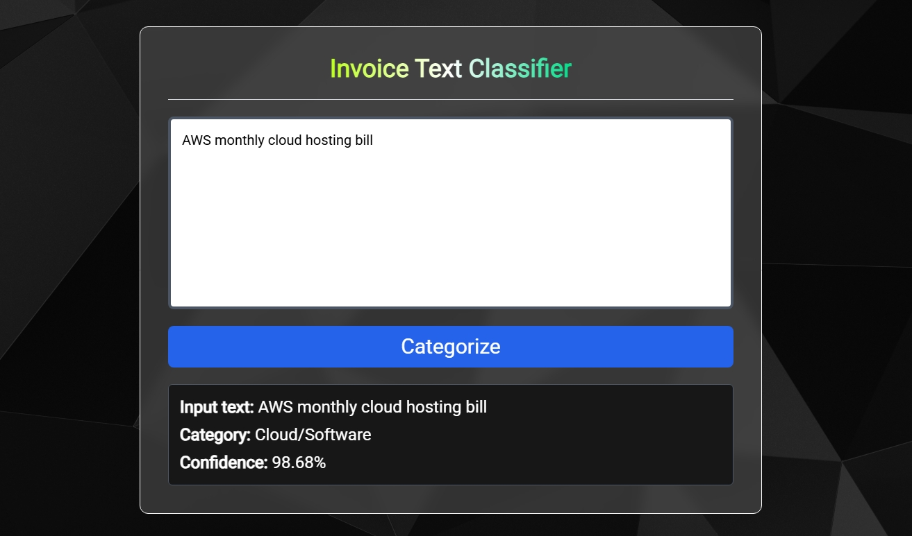

# Invoice Classifier

This is a simple ML model uses [TF-IDF](https://en.wikipedia.org/wiki/Tf%E2%80%93idf) (Term-Frequency Inverse-Document Frequency) and [Logistic Regression](https://en.wikipedia.org/wiki/Logistic_regression) for classifying invoice text into the following categories:
- Logistics
- Office Supplies
- Cloud/Software
- Utilities
- Travel
- Inventory



## Dependencies:

- Flask: For creating the web app that runs on the browser.
- Pandas: For reading, writing and manipulating data fetched from a CSV dataset.
- Scikit-learn: For training the classifier ML model on the training dataset.
- Joblib: For saving model weights after training and loading those weights during inference.

## Setup:

1. Clone this repository:

    ```bash
    git clone https://github.com/anurag1884/InvoiceExpenseClassifier
    cd InvoiceExpenseClassifier
    ```

2. Set up a Python virtual environment:

    ```bash
    python -m venv venv
    ```

4. Activate the virtual environment:

    - Windows:

        ```batch
        venv\Scripts\activate.bat
        ```

    - macOS/Linux:

        ```bash
        source venv/bin/activate
        ```

5. Install dependencies in the virtual environment:

    ```bash
    pip install -r requirements.txt
    ```

6. Run the app:

    ```bash
    python ./app.py
    ```

7. Open any browser and visit http://localhost:5000.

8. When done, deactivate the virtual environment and exit the terminal session:

    - Windows:

        ```bash
        venv\Scripts\deactivate.bat
        ```

    - macOS/Linux:

        ```bash
        source venv/bin/deactivate
        ```
